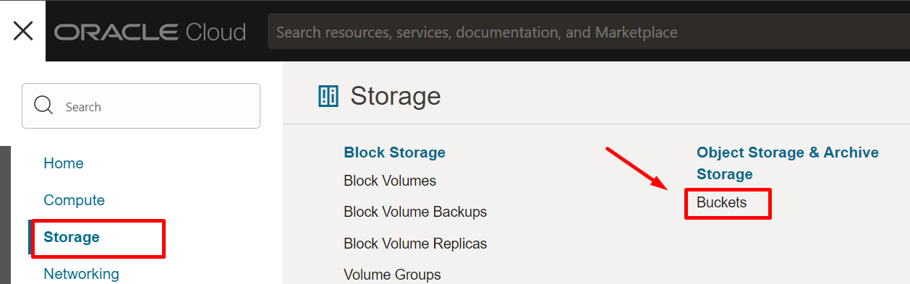
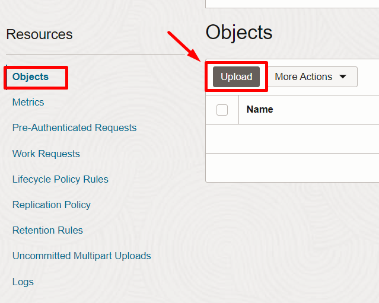
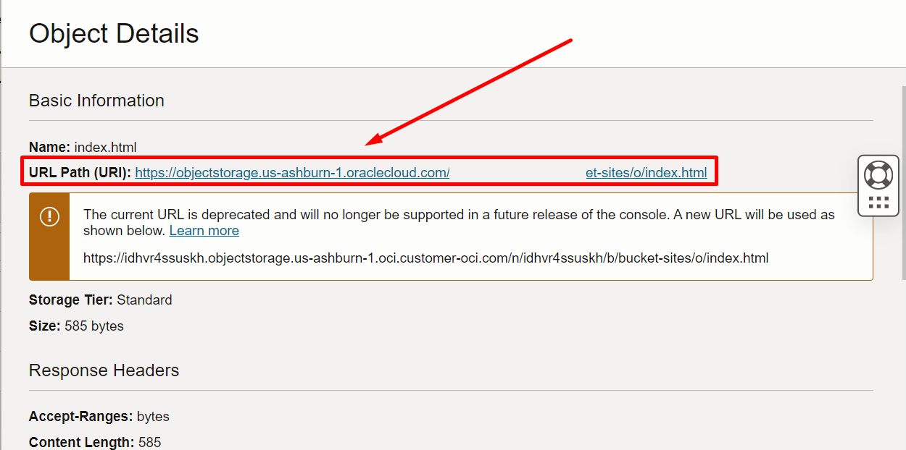
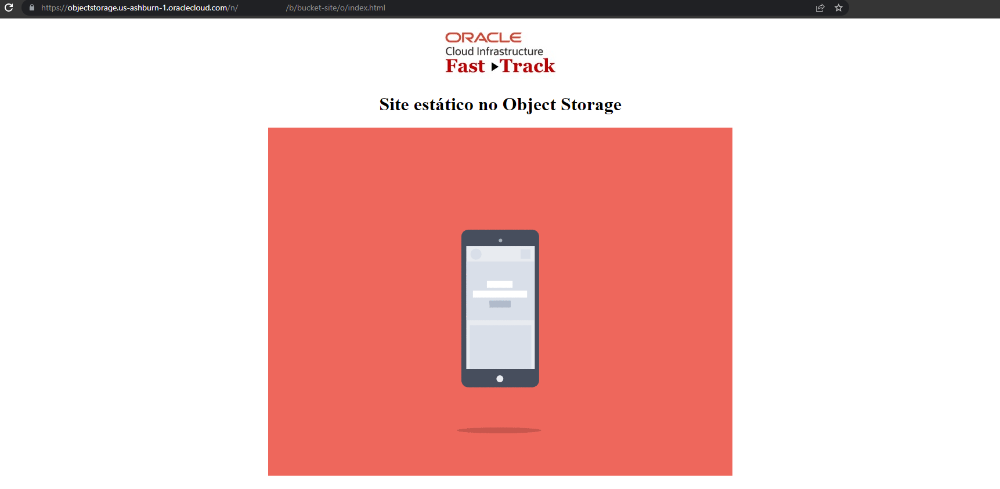

# Crear un Bucket 
## Introducción

Rendimiento a escala en nube que ofrece durabilidad de datos confiable y rentable. El servicio Object Storage puede almacenar una cantidad ilimitada de datos no estructurados de cualquier tipo de contenido, incluidos datos analíticos y contenido enriquecido como imágenes y videos.

En este laboratorio aprenderá cómo trabajar con Object Storage dentro de Oracle Cloud Infrastructure.


*Tiempo estimado para este laboratorio: 10 minutos*.

### Objetivos

- Crear un Bucket en OCI.
- Crear un site estático utilizando un Bucket.

### Pasos
- [Tarea 1: Crear un Bucket](#tarea-1-crear-un-bucket)
- [Tarea 2: Configuración de Bucket](#tarea-2-configuración-de-bucket)
- [Tarea 3: Disponibilizar sitio web estático](#tarea-3-disponibilizar-sitio-web-estático)

### Tarea 1: Crear un Bucket.

1. En el menú principal, de clic en la sección de **Storage** y posteriormente dirígete a **Buckets** 



2.	Luego haga clic en **Create Bucket**.


3. Complete el formulario como se muestra a continuación y haga clic en **Create**.
   
a.	**Bucket Name:** "Ingrese un nombre para su Bucket".

b.	**Default Storage Tier:** Standard. 


### Tarea 2: Configuración de Bucket.
1.	En su Bucket, haga clic en el ícono de tres puntos y luego seleccione la opción **Edit Visibility**.


2.	Cambie la visibilidad a "Public", desmarque la opción "Allow users to list objects from this bucket" y haga clic en **Save Changes.**


### Tarea 3: Disponibilizar sitio web estático.

1. Ingrese a su Bucket.
2. Haga clic en **Objects**, en el menú del izquierdo, y de click en **Upload**
 
 

 

3.	Copie el html a continuación y cree el archivo index.html usando un editor de texto (bloc de notas) Nota: Recuerda guardar el archivo con la extensión ".html" 
    ```sh
        <!DOCTYPE html>
        <html lang="pt-br">
        <head>
        <meta charset="UTF-8">
        <meta name="viewport" content="width=device-width, initial-scale=1.0">
        <title>LAB: OCI FAST TRACK</title>
        </head>
        <body>
        <center> 
        <h1>Site estático no Object Storage</h1> 
           
        </body>
        </html>

    ```

4.	Una vez hecho esto, arrástrelo y suéltelo en el campo del depósito indicado y haga clic en **Upload**.


5.	Para el objeto, haga clic en el icono de tres puntos y haga clic en **View Object Details**.


6. Haga clic en el URI indicado y verifique si el sitio está disponible. 





**Super! Continuemos con el siguiente laboratorio 🤩👉 [Laboratorio 6 - Load Balancer](https://github.com/mcrsoci/OCI-Fast-Track-v2/tree/main/Lab6-LoadBalancer)**
   
